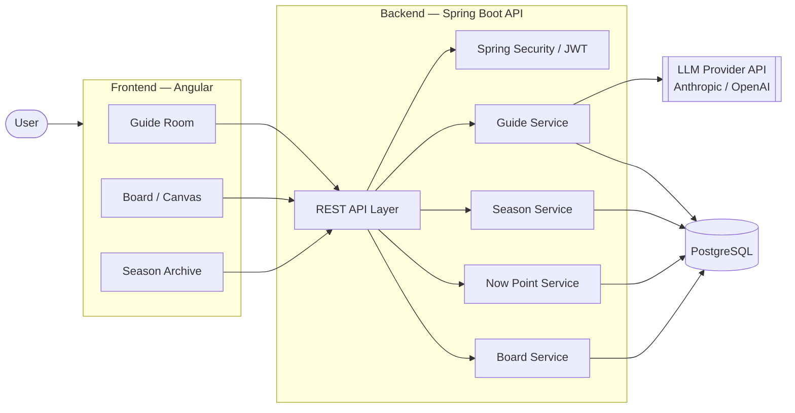

# Architecture

## High-level system view

**Key principle:** the LLM provider is only ever called from the backend (`GuideSvc`). API keys never reach the frontend or the browser. This is both a security requirement and a clean separation of concerns — the frontend only ever talks to *our* API.

## Why this split

| Layer | Responsibility |
|---|---|
| Frontend (Angular) | Rendering, user interaction, routing between Guide Room / Board / Season Archive |
| Backend API layer | Auth, request validation, orchestration between services |
| Guide Service | Builds the prompt/context sent to the LLM (personality kernel + active Season + Now Point), parses the response |
| Season Service | CRUD + lifecycle of Season entities (open/close/archive) |
| Now Point Service | Maintains the rolling short-term context state |
| Board Service | CRUD for board objects, including those auto-generated from a conversation |
| PostgreSQL | Source of truth for all persisted domain entities |

## Data flow — a single message round-trip

1. User sends a message from the Guide Room (Angular) → `POST /api/guide/messages`.
2. API layer authenticates the request (JWT, once auth is implemented — Phase 3+).
3. `GuideSvc` loads: active `Season`, current `NowPoint`, recent message history.
4. `GuideSvc` builds a system prompt encoding the personality kernel + active context, calls the LLM provider.
5. Response is parsed; if it implies a structural change (new Season, new Board object, updated Now Point), the relevant service persists it.
6. Response returned to frontend, rendered in the Guide Room.

## Phase-by-phase architectural growth

This skeleton (Phase 0/1) only implements the `/api/health` endpoint end-to-end. Each later phase adds one vertical slice without restructuring what exists:

- **Phase 1** — Guide Room (text-only chat, single Guide form, no persistence beyond raw messages).
- **Phase 2** — Now Point + Season engine (the context layer described above).
- **Phase 3** — Board / Canvas (auto-generated objects from conversation).
- **Phase 4** — Guide personas (personality kernel vs. swappable "skin").
- **Phase 5** — Activities library + recommendation logic.
- **Phase 6** — Notifications / affirmations engine.
- **Phase 7** — External extensions (e.g. Memory Lanes integration).

See [`ROADMAP.md`](ROADMAP.md) for the task-level breakdown of each phase.

## Cross-cutting concerns (present from Phase 0, not bolted on later)

- **Security**: Spring Security filter chain exists from commit #1 (currently permissive on `/api/health` only); JWT auth lands in Phase 3 when real user accounts are introduced.
- **CI**: GitHub Actions builds + tests both backend and frontend on every push (see `.github/workflows/ci.yml`).
- **Secrets**: never committed; local `.env` / GitHub Actions secrets only.
- **API docs**: Swagger/OpenAPI auto-generated from the backend (`springdoc-openapi`), no manual doc-writing needed.
